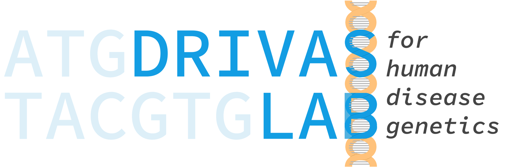
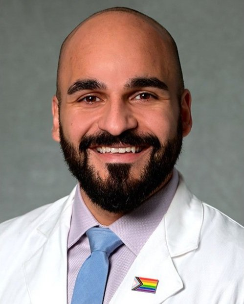

# Welcome to Drivas Lab Codebase

## About Us 🧫🧬
The overarching goal of our research is to understand the intersection of common and rare disease genetics to uncover the genetic architecture and molecular mechanisms of human disease. We take a conceptually innovative approach to our research, bridging genomics and classic genetics, integrating informatic, molecular, translational, and clinical approaches, to investigate our hypotheses and perform our work.

Our lab has a particular focus on disorders affecting the primary cilium, but our science is guided by genetic discovery and we are excited to tackle interesting questions agnostic of organ system or disease pathogenesis.

<!-- aspect ratio = 0.80:1 -->

Theodore G. Drivas, MD PhD

## Resources
- [Drivas Lab Website](https://drivaslab.org/)
- [Drivas Lab Publications](https://scholar.google.com/citations?hl=en&user=a392PNwAAAAJ)

<!--

**Here are some ideas to get you started:**

🙋‍♀️ A short introduction - what is your organization all about?
🌈 Contribution guidelines - how can the community get involved?
👩‍💻 Useful resources - where can the community find your docs? Is there anything else the community should know?
🍿 Fun facts - what does your team eat for breakfast?
🧙 Remember, you can do mighty things with the power of [Markdown](https://docs.github.com/github/writing-on-github/getting-started-with-writing-and-formatting-on-github/basic-writing-and-formatting-syntax)
-->
